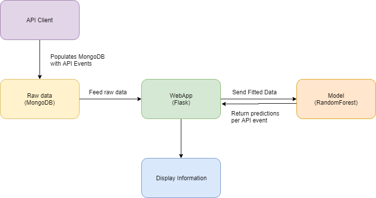

# Fraud Detection Case Study

Topics included in this case study include:
* Classification modeling.
* Programming Practice: Handing off models.
* Teamwork.
* Web applications.
* Website hosting with AWS
* Deploying a DS application.
* Data visualization.
* Results presentation.

#### Architecture

#### Deliverables

* A dashboard for investigators to use which helps them identify new events that are worthy of investigation for fraud.  This will pull in new data regularly, and update a useful display for the investigation team.  How you wish to lay this out is up to you.

#### Notes
